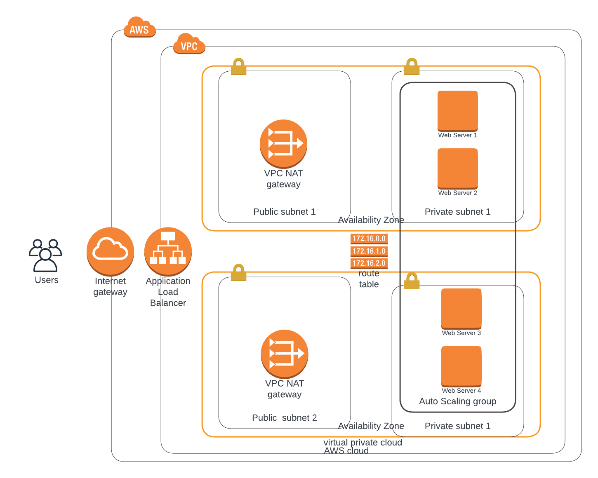

# Deploy a High-Availability Web App using CloudFormation

## Prject overview
This is the second project in udacity advanced cloud devops nanodegree where we have to create the infrastructure and deploy an app called udagram using cloudformation .

## Infrastructure Digram


## Command to create cloudformation stack
This command creates the all needed network  infrastructure including VPC,Private subnets,NatGateways,etc ..

```sh
aws cloudformation create-stack --stack-name udagram-network --template-body file://udagram-network.yml    --parameters file://udagram-network-parameters.json  --region=us-east-1
```

This command mainly creates the servers and loadbalancers  .

```sh
aws cloudformation create-stack --stack-name udagram-server --template-body file://udagram-server.yml    --parameters file://udagram-server-parameters.json  --region=us-east-1
```
## URLs
[LB URL](http://udagr-webap-dkgi26fgewb9-1957040691.us-east-1.elb.amazonaws.com)


